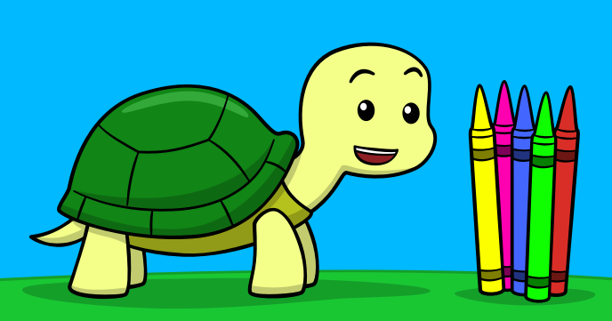

A lot of beginners are initiated into the world of coding via turtle graphics. 

In this tutorial you’ll learn how to create turtle graphics primitives in CodeGuppy. You’ll learn about:

-	Turtle graphics
-	How to use trigonometry functions
-	Arrow functions
 
## Source code 
The JavaScript source code of this program can be found [here](sketches/program.js). To run it, you need to import it in the [codeguppy.com](https://codeguppy.com) online editor. Alternatively, you can use the source code in your p5.js sketches (advanced use). 
## Online version 
To see the code running, check the online playground at [https://codeguppy.com/code.html?t=turtle_graphics](https://codeguppy.com/code.html?t=turtle_graphics) 
## Next steps 
Please check [codeguppy.com](https://codeguppy.com) for many other fun JavaScript programs and games for beginners. To stay up to date with CodeGuppy development please follow [@codeguppy](https://twitter.com/codeguppy) on Twitter.  
